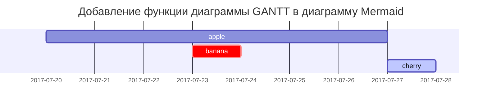

## Заголовки

<!-- markdownlint-capture -->
<!-- markdownlint-disable -->
# H1 — заголовок
{: .mt-4 .mb-0 }

## H2 — заголовок
{: data-toc-skip='' .mt-4 .mb-0 }

### H3 — заголовок
{: data-toc-skip='' .mt-4 .mb-0 }

#### H4 — заголовок
{: data-toc-skip='' .mt-4 }
<!-- markdownlint-restore -->

## Абзац

Это пример заполнительного текста для демонстрации оформления абзаца. Здесь показаны несколько предложений, чтобы увидеть переносы, отступы и межстрочный интервал в контексте темы.

## Списки

### Нумерованный список

1. Первый
2. Второй
3. Третий

### Маркированный список

- Раздел
  - Подраздел
    - Абзац

### Список задач

- [ ] Задача
  - [x] Шаг 1
  - [x] Шаг 2
  - [ ] Шаг 3

### Список определений

Солнце
: Звезда (пример записи в виде списка определений)

Луна
: Естественный спутник Земли, видимый благодаря отражённому Солнцем свету

## Блоковая цитата

> Эта строка демонстрирует _блоковую цитату_.

## Подсказки

<!-- markdownlint-capture -->
> `Совет` — пример подсказки.
{: .prompt-tip }

> `Информация` — пример подсказки.
{: .prompt-info }

<!-- markdownlint-disable -->
> `Предупреждение` — пример подсказки.
{: .prompt-warning }

<!-- markdownlint-restore -->
> `Опасность` — пример подсказки.
{: .prompt-danger }


## Таблицы

| Компания                     | Контакт         | Страна |
| :--------------------------  | :-------------- | ------:|
| Alfreds Futterkiste          | Maria Anders    | Германия |
| Island Trading               | Helen Bennett   | Великобритания |
| Magazzini Alimentari Riuniti | Giovanni Rovelli| Италия |

## Ссылки

<http://127.0.0.1:4000>

## Примечание

При клике на якорь вы перейдёте к примечанию[^footnote], и здесь ещё одно примечание[^fn-nth-2].

## Встроенный код

Это пример `встроенного кода`.

## Путь к файлу

Здесь `/path/to/the/file.extend`{: .filepath}.

## Блоки кода

### Общий

```text
Bu umumiy kod parchasidir, sintaksis yoritish va qator raqamlari yo'q.
```

### Специальный язык

```bash
if [ $? -ne 0 ]; then
  echo "Buyruq muvaffaqiyatli bajarilmadi.";
  # kerakli ishlarni bajaring / chiqish
fi;
```

### Специальное имя файла

```sass
@import
  "colors/light-typography",
  "colors/dark-typography";
```
{: file='_sass/jekyll-theme-chirpy.scss'}

## Математика

Математика поддерживается с помощью [**MathJax**](https://www.mathjax.org/):

$$
\begin{equation}
  \sum_{n=1}^\infty 1/n^2 = \frac{\pi^2}{6}
  \label{eq:series}
\end{equation}
$$

Мы можем ссылаться на уравнение как \eqref{eq:series}.

Если $a \ne 0$, квадратное уравнение $ax^2 + bx + c = 0$ имеет два корня:

$$ x = {-b \pm \sqrt{b^2-4ac} \over 2a} $$

## Mermaid SVG



## Изображения

### Стандарт (с подписью)

{: width="972" height="589" }
_Полная ширина экрана и центрированное выравнивание_

### Выровнено влево

{: width="972" height="589" .w-75 .normal}

### Обтекание слева

{: width="972" height="589" .w-50 .left}
Здесь размещён демонстрационный текст, показывающий обтекание изображения слева. Текст продолжает показ примера форматирования и интерлиньяжа.

### Обтекание справа

{: width="972" height="589" .w-50 .right}
Здесь расположен демонстрационный текст, показывающий обтекание изображения справа. Текст служит примером типографики рядом с изображением.

### Тёмный/светлый режим и тени

Следующее изображение переключается в зависимости от предпочтений темы (тёмная/светлая) и демонстрирует тени.

{: .light .w-75 .shadow .rounded-10 w='1212' h='668' }
{: .dark .w-75 .shadow .rounded-10 w='1212' h='668' }

## Видео



## Сноски

[^footnote]: Источник примечания
[^fn-nth-2]: Источник примечания 2

